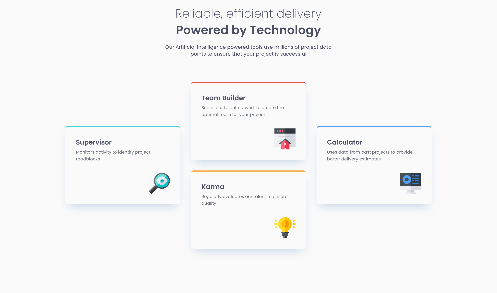
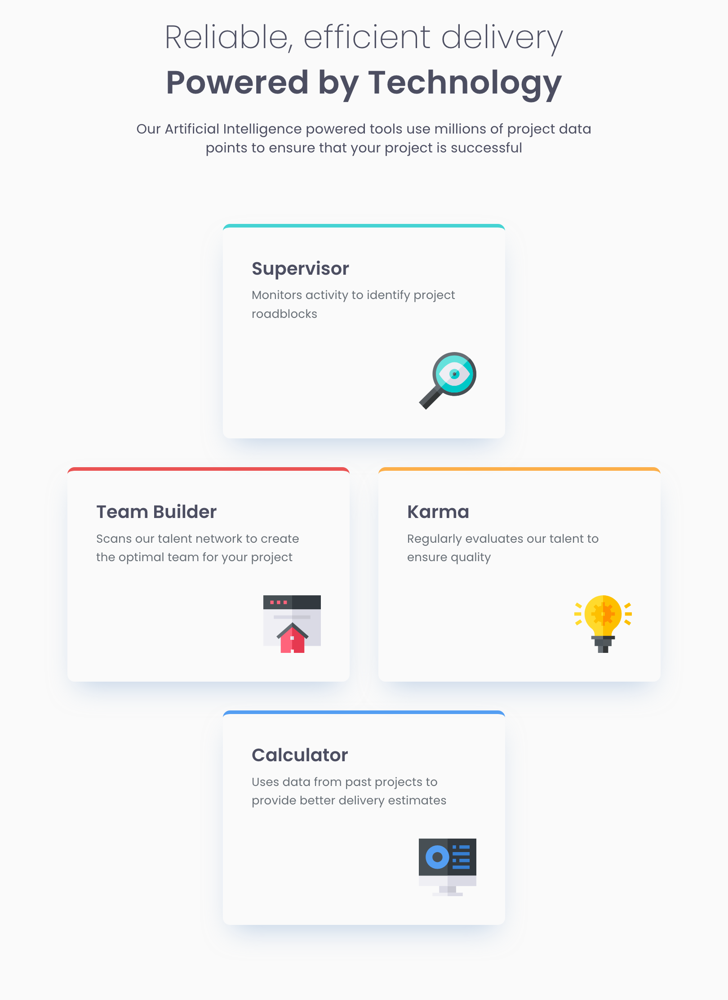
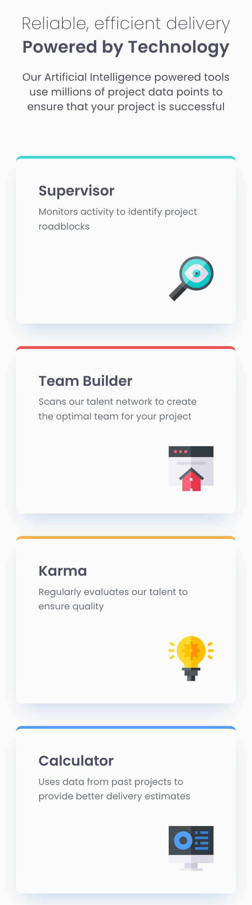

# Frontend Mentor - Four card feature section solution

This is a solution to the [Four card feature section challenge on Frontend Mentor](https://www.frontendmentor.io/challenges/four-card-feature-section-weK1eFYK). Frontend Mentor challenges help you improve your coding skills by building realistic projects.

## Table of contents

- [The challenge](#the-challenge)
- [Screenshots](#screenshots)
  - [1. Desktop version](#1-desktop-version)
  - [2. Tablet version](#2-tablet-version)
  - [3. Mobile version](#3-mobile-version)
- [Page speed insights](#page-speed-insights)
- [Links](#links)
- [My process](#my-process)
  - [Built with](#built-with)
  - [Tested with](#tested-with)
  - [What I learned](#what-i-learned)
- [Acknowledgement](#acknowledgement)
- [Author](#author)

## Overview

### The challenge

Users should be able to:

- View the optimal layout for the site depending on their device's screen size

## Screenshots

### 1. Desktop version



### 2. Tablet version



### 3. Mobile version



## Page speed insights

[Mobile version](https://pagespeed.web.dev/analysis/https-rupali317-github-io-four-card-feature-section-master/ppj9k41en9?form_factor=mobile)

[Desktop version](https://pagespeed.web.dev/analysis/https-rupali317-github-io-four-card-feature-section-master/ppj9k41en9?form_factor=desktop)

## Links

- Live site URL: [Four card feature section live URL](https://rupali317.github.io/four-card-feature-section-master/)
- Solution URL: [Four card feature section solution](https://github.com/rupali317/four-card-feature-section-master)

## My process

### Built with

- Semantic HTML5 markup
- CSS custom properties
- Flexbox
- Mobile-first workflow
- [Github Pages](https://pages.github.com/) - Allows to host static websites directly from a GitHub repository.

### Tested with

- Browsers used for testing: Google Chrome, Firefox, Safari, Brave, Microsoft Edge.
- Devices:
  - (Real) MacBook Pro (14-inch), Samsung Galaxy A33 5G, Samsung Galaxy S20+.
  - (Virtual) The mobile and tablet devices mentioned under Chrome's dev console.
- Screen reader: MacOS VoiceOver.

### What I learned

Initially I had the following code snippet, which caused accessibility issues by reading the text twice:

```html
<h1 class="text-preset-1">
  <div class="text-preset-2">Reliable, efficient delivery</div>
  Powered by Technology
</h1>
```

The screen reader declared that is a heading level 1 with 2 elements and the texts were repeated twice, which is not a good user experience.

Fixed it by the following:

```html
<h1 class="text-preset-1">
  Reliable, efficient delivery Powered by Technology
</h1>
```

```css
.text-preset-1 {
  font-weight: var(--font-weight-semi-bold);
  font-size: var(--font-size-4);
  line-height: var(--line-height-2);
  letter-spacing: var(--letter-spacing-1);
}

.text-preset-1::first-line {
  font-weight: var(--font-weight-extra-light);
  font-size: var(--font-size-4);
  line-height: var(--line-height-2);
  letter-spacing: var(--letter-spacing-1);
}
```

In the fixed approach, the heading 1 just has the text without any children HTML elements. This prevents the text from repeated twice. The different style within the heading is fixed by using `::first-line`

## Acknowledgement

- In all my projects, I always refer to CSS reset to provide a clean/consistent slate for the CSS stylings across all the browsers. [Joshua's CSS reset](https://www.joshwcomeau.com/css/custom-css-reset/), [Andy Bell's CSS reset](https://piccalil.li/blog/a-more-modern-css-reset/)

## Author

- Linkedin profile - [Rupali Roy Choudhury](https://www.linkedin.com/in/rupali-rc/)
- Frontend Mentor - [@rupali317](https://www.frontendmentor.io/profile/rupali317)
